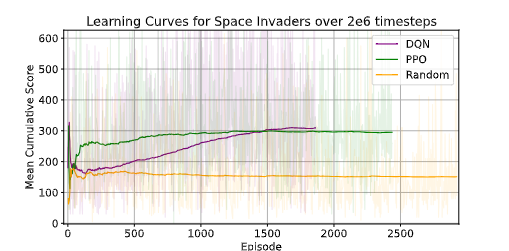

# PPO surrogate objective experiments for MuJoCo continuous-control environments.


The purpose of this experiment is to study how different PPO surrogate objectives affect learning stability, policy improvement, and exploration in MuJoCo continuous-control environments.

PPO is usually used because its clipped surrogate objective prevents the policy from changing too aggressively during training. The clipping mechanism is only one way to control policy updates. This project compares three PPO variants:

1. **PPO-Clip**, which uses the standard clipped surrogate objective.
2. **PPO-KL**, which removes clipping and instead controls policy updates using an adaptive KL-penalty objective with target-KL stopping.
3. **PPO-NoClip**, which removes the clipped surrogate objective and uses the plain likelihood-ratio policy gradient, optionally with target-KL stopping.

The main goal is to understand whether PPO’s performance and stability come mainly from the clipped surrogate objective, from KL-based update control, or from other optimisation choices such as entropy regularisation, GAE lambda, weight decay, and reset-based methods.

The experiments also investigate how regularisation techniques affect policy learning. This includes L1 regularisation, L2 regularisation or AdamW-style weight decay, and shrink-and-perturb resets. These ablations are used to test whether regularisation can improve robustness, reduce overfitting to recent trajectories, preserve policy plasticity, or prevent unstable policy updates.


## Reference results from PPO/DQN Atari experiments

The following table summarises results reported on Atari pixel-control environments. These results are included as contextual motivation for the current PPO surrogate-objective experiments, but they are not directly comparable to MuJoCo experiments because the environments, observation spaces, action spaces, and training setups differ.

The Atari experiments compared PPO Clip, PPO KL/Penalty, PPO No Clip, PPO with Random Network Distillation (RND), and DQN on `SpaceInvaders` and `Tennis`. Reported scores are average rewards over 100 randomly initialised evaluation episodes.

| Environment    | PPO Clip | PPO KL / Penalty | PPO No Clip | PPO RND |       DQN |   DQN sb3 |   PPO sb3 |
| -------------- | -------: | ---------------: | ----------: | ------: | --------: | --------: | --------: |
| Space Invaders |    258.6 |            195.0 |       225.1 |       - | 699 ± 266 | 623 ± 202 | 960 ± 425 |
| Tennis         |    -18.7 |            -23.4 |       -21.3 |   -13.8 |   -24 ± 0 |         - |         - |


<table>
  <tr>
    <td align="center">
      <br>
      <sub>PPO with RND on Atari Tennis</sub>
    </td> 
    <td align="center">
      <br>
      <sub>PPO variants on Space Invaders</sub>
    </td>
    <td align="center">
      <br>
      <sub>DQN, PPO, and random agent on Space Invaders</sub>
    </td>
  </tr>
</table>

PPO Clip achieved the strongest performance among the custom PPO variants on Space Invaders, while PPO KL/Penalty was more stable but slower to improve. PPO No Clip showed less stable learning behaviour, supporting the motivation for studying whether PPO’s clipped surrogate objective is a key contributor to stable policy improvement. PPO with RND improved exploration on the sparse-reward Tennis environment, suggesting that exploration bonuses or reset-based interventions may be useful when reward feedback is limited.

## Current setup

The default environment is `HalfCheetah-v5`, a MuJoCo continuous-control benchmark. The agent is trained to maximise episodic return while metrics such as approximate KL divergence, entropy, value loss, explained variance, gradient norm, action statistics, and state coverage are logged. These metrics allow comparison not only of final returns, but also of how each objective behaves during training.

This experiment aims to answer the following research question:

**How does the choice of PPO surrogate objective, together with regularisation and reset-based interventions, influence learning performance, stability, and exploration in continuous-control reinforcement learning?**

It also supports ablations for:

- L1 regularisation
- L2 regularisation / AdamW-style weight decay
- Shrink-and-perturb resets
- Surrogate objective choice
- KL target, clip range, entropy bonus, GAE lambda, seeds and environments

Default environment: `HalfCheetah-v5`.

## Install

```bash
python -m venv .venv
source .venv/bin/activate
pip install -r requirements.txt
```

MuJoCo environments are provided through Gymnasium's `gymnasium[mujoco]` extra.

## Run one experiment

```bash
python -m surrogate_obj_exp.train --config configs/halfcheetah_clip.yaml
python -m surrogate_obj_exp.train --config configs/halfcheetah_kl.yaml
python -m surrogate_obj_exp.train --config configs/halfcheetah_noclip.yaml
```

## Run ablations

```bash
bash scripts/run_ablation.sh
```

## Plot results

```bash
python -m surrogate_obj_exp.plot_results --log-dir results --out-dir plots
```

This generates:

- learning curves
- approximate KL curves
- entropy curves
- value-loss curves
- explained-variance curves
- clip-fraction curves where applicable
- XY state coverage trajectory plots
- aggregate CSV summaries

## Key metrics logged

Per update:

- episodic return mean/std/min/max
- episodic length mean
- policy loss
- value loss
- entropy
- approximate KL
- clip fraction
- explained variance
- gradient norm
- action mean/std
- objective name
- regularisation settings
- shrink-and-perturb settings
- state coverage proxy metrics

For MuJoCo XY coverage, the logger uses `info["x_position"]`/`info["y_position"]` when available, otherwise it falls back to observation dimensions `obs[0]` and `obs[1]` as a generic 2D projection.

## Repository layout

```text
SURROGATE_OBJ_EXP/
  configs/
  scripts/
  surrogate_obj_exp/
    buffers.py
    csv_logger.py
    envs.py
    metrics.py
    models.py
    ppo_clip.py
    ppo_kl.py
    ppo_no_clip.py
    regularisation.py
    train.py
    plot_results.py
    utils.py
```


## Notes

- These are research scripts, not heavily optimised distributed-training code.
- The default settings are intentionally modest so they are easier to run on a single machine.
- For publication-quality comparisons, run multiple seeds and report confidence intervals.
